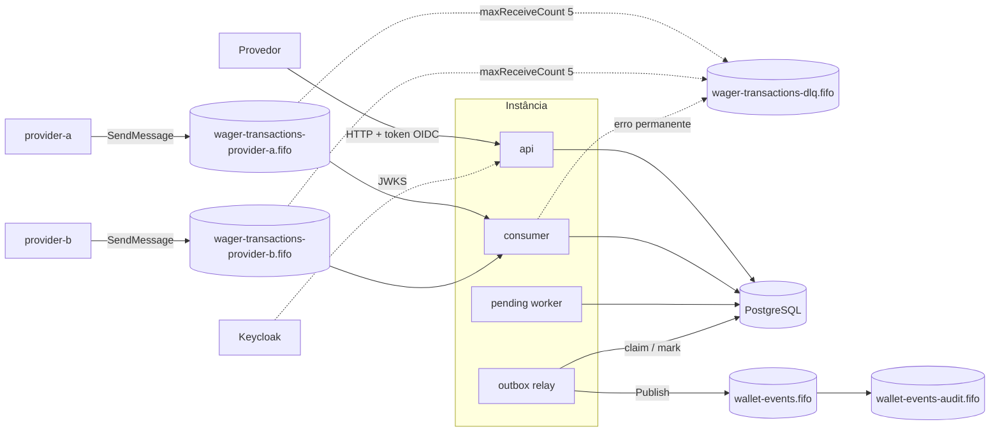
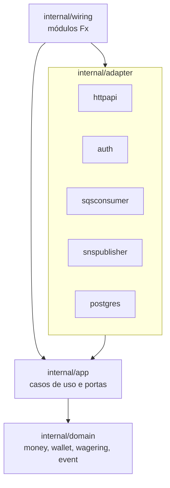
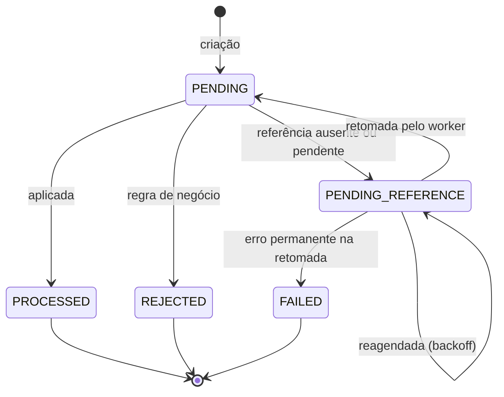
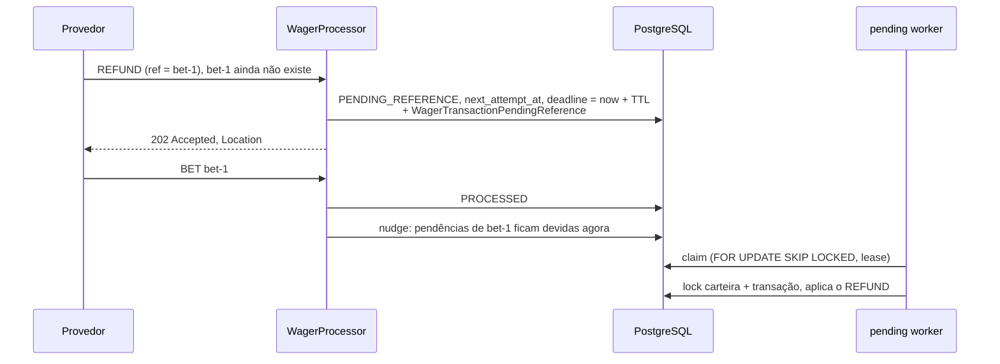

# Arquitetura

Este documento registra as decisões técnicas do serviço, as garantias oferecidas e como cada uma
é obtida no código. Instruções de execução estão no [README](README.md).

## Visão geral

O serviço é um **monólito modular hexagonal**. Um único binário (`cmd/wallet`) contém todos os
componentes, e a variável `APP_ROLES` escolhe quais deles cada processo executa:

| Papel | Componente | Módulo Fx |
| --- | --- | --- |
| `api` | Servidor HTTP com autenticação OIDC | `wiring.API` |
| `consumer` | Consumidor das filas de aposta, uma por provedor | `wiring.Consumer` |
| `outbox` | Relay da outbox para o tópico `wallet-events.fifo` | `wiring.Outbox` |
| `pending` | Worker que retoma operações à espera de referência | `wiring.Pending` |

Toda a coordenação entre instâncias acontece no PostgreSQL. Não existe estado compartilhado em
memória nem lock global; por isso qualquer número de instâncias pode rodar qualquer combinação de
papéis. O compose sobe três instâncias com todos os papéis.



### Camadas



- `internal/domain` não importa Fx, HTTP, SQS nem pgx. Entidades têm estado privado,
  construtores com validação, reidratação separada da criação e erros classificáveis com
  `errors.Is`/`errors.As`. Rejeições de negócio nunca usam `panic`.
- `internal/app` define as portas (`UnitOfWork`, repositórios, `OutboxQueue`, `PendingQueue`,
  `EventPublisher`) e os casos de uso: `WalletOpener`, `WagerProcessor`, `WagerIntake`,
  `PendingResumer`, `OutboxRelay` e `Queries`.
- `internal/adapter` implementa as portas. HTTP e SQS convertem suas entradas no mesmo
  `app.WagerCommand` e chamam o mesmo `WagerProcessor`, o que dá validação, hash e idempotência
  idênticos por construção.

## Garantias e como são obtidas

**Uma operação financeira confirmada nunca é perdida, nunca é aplicada duas vezes e nunca deixa
saldo negativo.** A tabela resume os mecanismos; as seções seguintes detalham cada um.

| Garantia | Mecanismo |
| --- | --- |
| Efeitos atômicos | Transação, saldo, ledger, inbox e outbox no mesmo commit (`UnitOfWork`) |
| Sem movimentação duplicada | Índices únicos de `(provider_id, idempotency_key)` e `(provider_id, external_transaction_id)`, inbox com PK `(consumer_name, message_id)`, `UNIQUE (wallet_id, transaction_id)` no ledger |
| Sem lost update | `SELECT ... FOR UPDATE` na carteira e `UPDATE ... WHERE version = $expected` |
| Sem saldo negativo | Agregado `Wallet` e `CHECK (balance_minor >= 0)` no banco |
| Mensagem SQS não se perde | Remoção da fila só depois do commit; reentrega vira replay |
| Evento não se perde | Outbox gravada no commit; relay nunca descarta; lease expira se a instância morrer |
| Pendência não se perde | Estado `PENDING_REFERENCE` persistido com `next_attempt_at`; qualquer instância retoma |
| Ledger íntegro | Triggers append-only, encadeamento de saldos e verificação diferida saldo × ledger |

### Crash em cada ponto

```mermaid
sequenceDiagram
    participant Q as SQS
    participant C as consumer
    participant DB as PostgreSQL
    participant R as relay
    participant T as SNS
    Q->>C: ReceiveMessage
    Note over C: crash aqui: nada gravado,<br/>mensagem volta após o visibility timeout
    C->>DB: BEGIN; inbox + transação + saldo + ledger + outbox; COMMIT
    Note over C: crash aqui (consumer.after_commit):<br/>reentrega encontra a inbox e só apaga a mensagem
    C->>Q: DeleteMessage
    R->>DB: claim (lease)
    Note over R: crash aqui: lease expira,<br/>outra instância reivindica
    R->>T: Publish (dedup id = eventId)
    Note over R: crash aqui (outbox.after_publish):<br/>republicação com o mesmo eventId
    R->>DB: published_at = now()
```

Os pontos marcados com nome são exercitados pelos testes e2e com a build tag `faultinject`,
que mata o processo com `SIGKILL` exatamente ali. O terceiro ponto testado,
`pending.after_claim`, cobre o worker de pendências morto depois de reivindicar um lote.

## Dinheiro

- `money.Money` guarda `int64` em unidades mínimas (centavos) e a moeda. O intervalo
  representável é ±92.233.720.368.547.758,07.
- Moedas aceitas: `BRL`, `EUR` e `USD` (ISO 4217, todas com duas casas decimais).
- O parsing usa a expressão `^(0|[1-9][0-9]*)(?:\.([0-9]{1,2}))?$`: rejeita vazio, sinal,
  espaços, zeros à esquerda, notação científica, `NaN`, `Infinity` e mais de duas casas. Nada é
  arredondado. `"25"` e `"25.5"` são aceitos e normalizados para `"25.00"` e `"25.50"` antes do
  hash de idempotência.
- Parsing, soma, subtração e negação verificam overflow; aritmética e comparação exigem a mesma
  moeda. Nenhum caminho passa por `float32`/`float64`.
- No banco, valores ficam em colunas `BIGINT` `*_minor` e a moeda em `CHAR(3)`. Na API e nos
  eventos, sempre `{"amount":"25.00","currency":"BRL"}`.

## Persistência e transações

- Driver: **pgx v5** com SQL explícito, sem ORM. Pool em `postgres.NewPool`.
- `postgres.UnitOfWork.Do` abre uma transação `READ COMMITTED`, aplica `lock_timeout`
  (`DB_LOCK_TIMEOUT`) e `statement_timeout` (`DB_STATEMENT_TIMEOUT`) locais à transação, entrega
  ao caso de uso repositórios ligados a ela (`Wallets`, `Transactions`, `Ledger`, `Outbox`,
  `Inbox`) e faz o commit. A fronteira da transação é o caso de uso, nunca o repositório.
- As leituras de `postgres.ReadModel`, inclusive a reconciliação somente leitura, usam o mesmo
  `statement_timeout` e um prazo de contexto igual a `DB_STATEMENT_TIMEOUT`. O pool aplica
  `statement_timeout` na sessão ao abrir cada conexão.
- A transação inteira é repetida (até 4 tentativas, backoff exponencial com jitter de 20 ms a
  500 ms) para falhas transitórias: serialização, deadlock, `lock_timeout`/`statement_timeout`,
  erros de conexão e violações dos índices únicos que indicam corrida
  (`wager_tx_provider_external_key`, `wager_tx_provider_idempotency_key`,
  `wager_tx_single_reversal`, `inbox_messages_pkey`). Na nova tentativa o registro vencedor já
  está visível e a resposta vira replay ou conflito. Esgotadas as tentativas, o erro é
  `app.ErrUnavailable`.
- Dois papéis de banco: `wallet_owner` é dono do schema e roda as migrations; `wallet_app` só
  tem `SELECT/INSERT/UPDATE` nas tabelas (e `DELETE` apenas na outbox). Como não é dono, não
  consegue desabilitar triggers. `wallet_app` tem `idle_in_transaction_session_timeout` de 15 s.

### Invariantes impostas pelo schema

| Tabela | Proteções |
| --- | --- |
| `wallets` | `UNIQUE (player_id, currency)`, `balance_minor >= 0`, `version >= 1`; trigger impede exclusão, alteração de identidade, mudança de saldo sem `version + 1` e mudança de versão sem mudança de saldo |
| `wager_transactions` | Formato por origem (`INTERNAL` só `OPENING`; `EXTERNAL` exige provedor, IDs, chave, hash, rodada e jogo), valor por tipo (`LOSS` = 0, demais > 0), referência obrigatória em reversões, formato de falha e resultado por estado, `OPENING` único por carteira, no máximo uma reversão `PROCESSED` por referência; trigger impede exclusão, alteração de campos de negócio e qualquer mudança em transação terminal |
| `wallet_ledger_entries` | `UNIQUE (wallet_id, transaction_id)` e `(wallet_id, wallet_version)`, aritmética `after = before ± amount`, append-only por trigger, encadeamento (cada lançamento parte do saldo do anterior; o primeiro parte de zero) |
| `wallets` × ledger | Constraint trigger `DEFERRABLE INITIALLY DEFERRED`: no commit, todo saldo com versão > 1 (ou saldo > 0) precisa de um lançamento com a mesma versão e o mesmo saldo final |
| `inbox_messages` | PK `(consumer_name, message_id)`, append-only |
| `outbox_events` | Conteúdo imutável (inclusive `traceparent`, com formato W3C verificado), evento publicado não volta a não publicado, evento não publicado não pode ser apagado |

## Concorrência

A coordenação é **por carteira**, com lock pessimista:

1. `WagerProcessor.Execute` procura a operação pela chave de idempotência e pelo ID externo
   (replay rápido, sem lock).
2. Lê a carteira com `SELECT ... FOR UPDATE`. Escritores da mesma carteira são serializados;
   carteiras diferentes seguem em paralelo.
3. Refaz a busca de replay, porque um pedido concorrente da mesma operação pode ter confirmado
   enquanto esperava o lock.
4. Avalia a referência, aplica o débito/crédito no agregado e grava transação, saldo, ledger e
   outbox.

A atualização de saldo ainda usa `WHERE version = $expected` e os triggers exigem versão
incrementada e lançamento correspondente, então mesmo um erro de programação não descarta uma
atualização confirmada. O worker de pendências segue a mesma ordem de locks (carteira, depois
transação), evitando deadlocks com o processamento síncrono.

Os testes cobrem duas apostas de 80.00 sobre saldo de 100.00 (uma processada, uma
`INSUFFICIENT_FUNDS`, saldo 20.00, um débito no ledger), a mesma aposta 50 vezes em paralelo em
três processos e carteiras distintas em paralelo.

## Idempotência

- HTTP exige o header `Idempotency-Key` (até 200 caracteres). O servidor usa a chave recebida
  como está; nunca a substitui por uma calculada. Pelo SQS, a chave é `data.idempotencyKey`.
- **Hash do payload**: SHA-256 sobre JSON canônico (chaves ordenadas, sem espaços, sem escape de
  HTML), prefixado com `sha256:`. Campos: `providerId`, `externalTransactionId`, `playerId`,
  `walletId`, `roundId`, `gameId`, `kind`, `money.amount`, `money.currency` e, quando presente,
  `referenceExternalTransactionId`. UUIDs são normalizados para a forma canônica minúscula e o
  valor para duas casas. A chave de idempotência, o `messageId` e metadados de transporte ficam
  fora, então HTTP e SQS produzem o mesmo hash.
- Regras:
  - mesma chave e mesmo hash: devolve a transação persistida com `idempotentReplay: true`,
    incluindo o saldo observado no processamento original;
  - mesma chave, hash diferente: `409 IDEMPOTENCY_KEY_REUSED`;
  - mesmo `(providerId, externalTransactionId)` com outra chave: `409 EXTERNAL_TRANSACTION_CONFLICT`.
- A idempotência é persistente: vem dos índices únicos em `wager_transactions` e sobrevive ao
  reinício de todos os processos.

## Máquina de estados da transação



- Operações sem dependência são concluídas na mesma transação em que são criadas; `PENDING`
  nunca é confirmado sozinho. O único estado intermediário persistido é `PENDING_REFERENCE`, e
  ele sempre tem `next_attempt_at` e `reference_deadline_at` (constraint
  `wager_tx_schedule_shape`), o que garante retomada durável.
- Estados terminais não mudam mais: o domínio recusa a transição e o trigger do banco também.
- **Falhas transitórias** (banco indisponível, timeout de lock, corrida em índice único) nunca
  geram estado persistido: a transação é revertida e repetida, o HTTP responde `503` e a
  mensagem SQS volta à fila. **Falhas permanentes** de entrada (validação, carteira inexistente,
  conflito de chave) também não persistem nada e são reportadas como erro (HTTP `4xx`, SQS DLQ).
  `FAILED`/`PROCESSING_FAILED` só é gravado quando o worker de pendências encontra um erro
  permanente inesperado ao retomar uma operação já persistida, para que ela pare de ser tentada
  e fique auditável. O `failureDetail` persistido (e devolvido no GET) é o texto fixo
  `processing failed`; a causa interna vai só para o log.

### Códigos de falha

| Código | Estado | Significado |
| --- | --- | --- |
| `INSUFFICIENT_FUNDS` | `REJECTED` | `BET` sem saldo |
| `REVERSAL_INSUFFICIENT_FUNDS` | `REJECTED` | Reversão que precisaria debitar mais que o saldo |
| `REFERENCE_NOT_FOUND` | `REJECTED` | Referência não chegou dentro do TTL ou das tentativas |
| `REFERENCE_NOT_PROCESSED` | `REJECTED` | Referência existe mas terminou `REJECTED` ou `FAILED` |
| `REFERENCE_MISMATCH` | `REJECTED` | Provedor, rodada, jogador, carteira ou moeda divergem |
| `REFERENCE_AMOUNT_MISMATCH` | `REJECTED` | Valor da reversão diferente do referenciado |
| `REFERENCE_KIND_NOT_ALLOWED` | `REJECTED` | Tipo referenciado não pode ser alvo desta operação |
| `REFERENCE_ALREADY_REVERSED` | `REJECTED` | A referência já tem uma reversão processada |
| `PROCESSING_FAILED` | `FAILED` | Erro permanente de processamento; `failureDetail` é sempre `processing failed` |

Todos esses códigos são resultados definitivos. Entradas corrigíveis nunca são persistidas; elas
voltam como `400 VALIDATION_ERROR` (com o campo), `WALLET_NOT_FOUND` ou `WALLET_MISMATCH`.

## Operações e reversões

| Tipo | Efeito | Referência |
| --- | --- | --- |
| `BET` | Débito; exige saldo | Não aceita |
| `WIN` | Crédito | Opcional; se informada, deve ser uma `BET` |
| `LOSS` | Nenhum (valor `0.00`); gera só `WagerTransactionProcessed` | Não aceita |
| `REFUND` | Crédito do valor integral | Obrigatória; `BET` |
| `ROLLBACK` | Movimento contrário ao original | Obrigatória; `BET`, `WIN` ou `REFUND` |
| `OPENING` | Crédito do saldo inicial | Uso interno; recusado por HTTP e SQS |

A referência é resolvida por `(providerId, referenceExternalTransactionId)` e precisa concordar
em provedor, rodada, jogador, carteira e moeda; reversões exigem valor igual (sem reversão
parcial).

**`REFUND` e `ROLLBACK` sobre a mesma aposta**: cada transação aceita **no máximo uma reversão
bem-sucedida, de qualquer tipo** (índice único parcial `wager_tx_single_reversal` e checagem
`REFERENCE_ALREADY_REVERSED` no domínio). Assim, depois de um `REFUND` de uma `BET`, um
`ROLLBACK` da mesma `BET` é rejeitado e o débito nunca é devolvido duas vezes. Para desfazer o
`REFUND`, o provedor envia um `ROLLBACK` que referencia o próprio `REFUND` (débito).

## Referências pendentes



- Ao receber uma operação cuja referência não existe ou ainda está `PENDING`/
  `PENDING_REFERENCE`, o processador grava `PENDING_REFERENCE` com a primeira tentativa em
  `PENDING_BACKOFF_BASE` e o prazo em `PENDING_REFERENCE_TTL`, e emite
  `WagerTransactionPendingReference`. HTTP responde `202`; pelo SQS a inbox registra
  `PENDING_REFERENCE` e a mensagem é removida, porque a continuidade passa a ser do worker.
- O worker (`PendingStore.ClaimDue`) reivindica lotes com `FOR UPDATE SKIP LOCKED`, incrementa
  `attempts` e usa o próprio `next_attempt_at` como lease (`PENDING_LEASE`): se a instância
  morrer, a linha volta a ficar devida quando o lease vence.
- Cada pendência é retomada em sua própria transação:
  - referência disponível: aplica ou rejeita normalmente;
  - ainda indisponível e `attempts < PENDING_MAX_ATTEMPTS` e antes do prazo: reagenda com
    backoff exponencial (`PENDING_BACKOFF_BASE` até `PENDING_BACKOFF_MAX`, jitter de ±20%);
  - tentativas ou TTL esgotados: `REJECTED` com `REFERENCE_NOT_FOUND` e evento de rejeição.
- Quando uma operação é processada, as pendências que a referenciam são "cutucadas"
  (`NudgeWaiting`) para serem avaliadas imediatamente, sem esperar o backoff.
- Referência que existe mas terminou `REJECTED`/`FAILED`: rejeição com
  `REFERENCE_NOT_PROCESSED`.

## Consumidor SQS

- Cada fila de `SQS_PROVIDER_QUEUES` reserva uma vaga de `SQS_MAX_IN_FLIGHT` e só então faz long
  polling de 20 s pedindo uma mensagem. A visibilidade não é prolongada enquanto não há vaga nem
  durante o tratamento: `SQS_MESSAGE_TIMEOUT` cabe inteiro no visibility timeout, então o
  tratamento termina antes de a mensagem voltar. Se uma chamada devolver mais de uma mensagem do
  mesmo `MessageGroupId`, elas seguem em ordem na mesma vaga; as que ficarem para trás são
  liberadas com visibilidade 0.
- `MessageGroupId`: os produtores usam o `walletId`, o que preserva a ordem por carteira.
  `MessageDeduplicationId`: definido pelo produtor (a fila não usa deduplicação por conteúdo). A
  deduplicação de 5 minutos do SQS é só uma otimização: a garantia vem da inbox e da
  idempotência.
- `WagerIntake.Handle` abre uma transação, consulta a inbox por `(consumer_name, message_id)` e:
  - se já existe com o mesmo hash, trata como duplicata e apenas remove a mensagem;
  - se existe com hash diferente, `MESSAGE_CONFLICT` (vai para a DLQ);
  - senão executa o `WagerProcessor` **na mesma transação** e grava a inbox com o resultado
    (`PROCESSED`, `REJECTED`, `PENDING_REFERENCE` ou `REPLAYED`).
- A mensagem só é apagada depois do commit. Uma rejeição de negócio confirmada é terminal e a
  mensagem é apagada.
- O hash da inbox cobre todos os campos enviados pelo produtor, incluindo a chave de
  idempotência, e exclui metadados de transporte.
- O provedor de uma mensagem é a fila em que ela chegou. Se o `providerId` do corpo for outro,
  a mensagem vai para a DLQ com `PROVIDER_NOT_ALLOWED`. Atributos que o produtor possa definir
  não escolhem o provedor. A política IAM de cada produtor só permite `SendMessage` na fila
  dele; a LocalStack Community não avalia IAM, então o vínculo da fila é o que a aplicação
  impõe, e o IAM é o controle do broker que a LocalStack não executa. As regras de domínio
  continuam valendo depois dessa checagem.

### Retry e DLQ

| Situação | Tratamento |
| --- | --- |
| Falha transitória (banco indisponível, timeout) | Visibilidade alterada para `2^n` s (n = receive count, máximo 300 s); o resto do grupo é liberado para manter a ordem |
| Tentativas esgotadas | O redrive da fila (`maxReceiveCount` 5) move a mensagem para a DLQ |
| Erro permanente | Enviada à DLQ pelo próprio consumidor e apagada da fila |
| Falha ao enviar à DLQ | Mensagem fica na fila para nova tentativa; o redrive a leva à DLQ depois |

Motivos de DLQ (atributo `failureReason`): `INVALID_MESSAGE`, `PROVIDER_NOT_ALLOWED`,
`VALIDATION_ERROR`, `WALLET_NOT_FOUND`, `WALLET_MISMATCH`, `IDEMPOTENCY_KEY_REUSED`,
`EXTERNAL_TRANSACTION_CONFLICT`, `MESSAGE_CONFLICT`, `PERMANENT_ERROR`. A mensagem vai com o
corpo original e os atributos `failureReason`, `failureDetail` (até 256 caracteres),
`sourceMessageId` e `consumer`; na DLQ o `MessageDeduplicationId` é o ID da mensagem original.

Visibility timeout das filas: `SQS_QUEUE_VISIBILITY_TIMEOUT` (60 s por padrão), o mesmo valor
que `deploy/aws/init-aws.sh` aplica. A configuração rejeita `SQS_MESSAGE_TIMEOUT` maior ou
igual a esse visibility. O tratamento de cada mensagem tem prazo de `SQS_MESSAGE_TIMEOUT`
(30 s por padrão) e não é cancelado pelo shutdown: termina dentro do prazo ou falha e volta
para a fila. O consumidor não recebe antes de reservar a vaga e não estende a visibilidade
enquanto a mensagem espera ou está em tratamento.

## Transactional outbox

- Os eventos são gravados em `outbox_events` na mesma transação da operação. O payload é um
  snapshot imutável, em coluna `JSON` (não `JSONB`) para ser republicado byte a byte. A coluna
  `traceparent`, também imutável, guarda o contexto de trace da operação que gerou o evento.
- O relay (`app.OutboxRelay`) reivindica lotes com `UPDATE ... WHERE id IN (SELECT ... FOR
  UPDATE SKIP LOCKED)` em ordem de `seq`, gravando `locked_by` e `next_attempt_at = now() +
  OUTBOX_LEASE`. Um evento não entra no lote enquanto existir outro da mesma `partition_key`
  com `seq` menor e `published_at` nulo: um evento anterior em lease ou em backoff segura a
  partição. O SNS FIFO ordena pela ordem de `Publish`, não pelo `seq`. Os relógios usados são
  os do banco, então todas as instâncias concordam sobre a expiração.
- Publicado com sucesso: `published_at = now()` condicionado a `published_at IS NULL`; se outro
  publisher confirmou antes, o resultado é `lease_lost` e nada muda.
- Falha na publicação: reagenda com backoff exponencial (`OUTBOX_BACKOFF_BASE` até
  `OUTBOX_BACKOFF_MAX`, 1 s a 5 min por padrão, com jitter) e guarda `last_error`. O relay nunca
  desiste de um evento.
- Expurgo: com `OUTBOX_RETENTION` definido, um worker do papel `outbox` apaga a cada minuto, em
  lotes de 1000, eventos publicados há mais tempo que a retenção. Eventos não publicados nunca
  são apagados (o trigger da tabela também impede). Por padrão (`0`) nada é apagado.
- Instância morta com lease: o evento volta a ficar devido quando o lease vence. No shutdown
  gracioso, o relay libera seus leases (`ReleaseLeases`) para que outra instância os assuma na
  hora.
- Entrega **at-least-once**: se o processo morrer entre publicar e marcar, o evento é
  republicado com o mesmo `eventId`.

### Destino e contrato dos eventos

- Tópico SNS FIFO `wallet-events.fifo`. `MessageGroupId` = chave de partição do evento (o
  `walletId`), preservando a ordem por carteira. `MessageDeduplicationId` = `eventId`, então uma
  republicação dentro da janela de deduplicação é descartada pelo SNS; consumidores devem
  deduplicar por `eventId` fora dela.
- Atributos de mensagem: `eventType`, `eventVersion` e `correlationId`.
- A fila `wallet-events-audit.fifo` assina o tópico com raw delivery e serve para inspeção.
- Envelope:

```json
{
  "eventId": "...", "eventType": "WalletBalanceChanged", "aggregateType": "...",
  "aggregateId": "...", "correlationId": "...", "causationId": "msg-123",
  "occurredAt": "2026-09-08T12:00:00Z", "version": 1, "data": { }
}
```

| Evento | Quando |
| --- | --- |
| `WagerTransactionProcessed` | Operação concluída, incluindo `LOSS` e `OPENING` |
| `WagerTransactionRejected` | Rejeição definitiva |
| `WagerTransactionPendingReference` | Operação passou a esperar a referência |
| `WalletBalanceChanged` | Saldo alterado; `walletId`, `transactionId`, `direction`, `money`, `balanceBefore`, `balanceAfter`, `walletVersion` |

`causationId` é o `messageId` quando a operação veio pelo SQS. Timestamps em UTC RFC 3339,
valores monetários em strings decimais. Operações que terminam `FAILED` não geram evento.

## Autenticação e autorização

- **IdP**: Keycloak, com o realm `wallet` versionado em `deploy/keycloak/wallet-realm.json` e
  importado na partida. Serviços usam `client_credentials`; o serviço não guarda senhas nem emite
  tokens.
- **Validação**: local, pela biblioteca `go-oidc`, contra o JWKS (`OIDC_JWKS_URL`), com as chaves
  em cache e recarregadas quando aparece um `kid` desconhecido (rotação). São exigidos
  assinatura RS256, issuer (`OIDC_ISSUER`), audience `wallet-api` (`OIDC_AUDIENCE`) e validade.
  O JWKS pode usar um hostname interno (`keycloak:8080`) enquanto o issuer é o público
  (`localhost:8080`). Validação local evita uma chamada ao IdP por requisição.
- **Permissões por scope**:

| Scope | Permite | Clientes locais |
| --- | --- | --- |
| `wagering:write` | `POST /wagering/transactions` | `provider-a`, `provider-b` |
| `wagering:read` | Consultar transações do próprio provedor | `provider-a`, `provider-b` |
| `wagering:read-all` | Consultar transações de qualquer provedor | `wallet-backoffice` |
| `wallets:write` | `POST /wallets` | `wallet-backoffice` |
| `wallets:read` | Carteira e ledger | `wallet-backoffice` |
| `wallets:reconcile` | Reconciliação | `wallet-backoffice` |

- **Identidade do provedor**: um mapper do Keycloak coloca o claim `provider_id` no token. O
  `providerId` do corpo precisa ser igual a ele (senão `403 PROVIDER_MISMATCH`), antes de
  qualquer acesso ao domínio. Consultas de transação por provedor sem `wagering:read-all` também
  exigem o mesmo `provider_id`; na consulta por ID interno, uma transação de outro provedor
  responde `404`, sem revelar sua existência. Operações de carteira são restritas ao cliente
  interno `wallet-backoffice`, pois nenhum cliente de provedor recebe scopes `wallets:*`.
- **Mensageria**: `init-aws.sh` cria uma fila FIFO por provedor
  (`wager-transactions-provider-a.fifo` e `wager-transactions-provider-b.fifo`), a DLQ
  compartilhada e as políticas `wallet-consumer` (consumir as duas filas, enviar à DLQ, publicar
  no tópico), `provider-a-producer` e `provider-b-producer` (apenas `SendMessage` na fila do
  próprio provedor). Elas ficam nos usuários de mesmo nome. Cada execução troca as chaves de
  acesso desses usuários e grava um arquivo de credenciais compartilhado; as instâncias da
  aplicação usam o perfil `wallet-consumer`. O consumidor aceita a mensagem só quando o
  `providerId` do corpo é o da fila de origem e, em seguida, aplica as regras de domínio. A
  LocalStack Community não avalia as políticas: o vínculo da fila é o controle da aplicação, e
  o IAM é o controle do broker que a LocalStack não executa.

## Contrato HTTP

Erros usam RFC 9457 (`application/problem+json`) com `code`, `retryable` e `correlationId`;
erros de validação trazem `errors[]` com `field` e `reason`. Toda resposta carrega o header
`X-Correlation-ID` (aceito do cliente quando válido, gerado caso contrário). Corpos acima de
64 KiB, campos desconhecidos e JSON com mais de um objeto são rejeitados.

| Método e rota | Scope | Sucesso |
| --- | --- | --- |
| `POST /wallets` | `wallets:write` | `201` com `Location` |
| `GET /wallets/{walletId}` | `wallets:read` | `200` |
| `GET /wallets/{walletId}/ledger?cursor=&limit=` | `wallets:read` | `200` com `items` e `nextCursor` (limite padrão 50, máximo 200, cursor opaco por versão da carteira) |
| `POST /wallets/{walletId}/reconciliation` | `wallets:reconcile` | `200` |
| `POST /wagering/transactions` | `wagering:write` | ver abaixo |
| `GET /wagering/transactions/{transactionId}` | `wagering:read` ou `wagering:read-all` | `200` |
| `GET /providers/{providerId}/wagering/transactions/{externalTransactionId}` | `wagering:read` ou `wagering:read-all` | `200` |
| `GET /health/live` | público | `200` |
| `GET /health/ready` | público | `200` ou `503` |

Resultado de `POST /wagering/transactions` (corpo `transactionId`, `status`, `balance`,
`failureCode`, `nextAttemptAt`, `idempotentReplay`):

| Situação | Status | `code` / corpo |
| --- | --- | --- |
| Processada (ou replay de processada) | `200` | `status: PROCESSED` |
| Aguardando referência | `202` + `Location` | `status: PENDING_REFERENCE`, `nextAttemptAt` |
| Rejeição de negócio | `422` | `status: REJECTED`, `failureCode` |
| Falha permanente registrada | `500` | `status: FAILED` |
| Entrada inválida | `400` | `VALIDATION_ERROR`, `WALLET_NOT_FOUND`, `WALLET_MISMATCH` |
| Sem token ou token inválido/expirado | `401` | `UNAUTHENTICATED` |
| Scope ausente / provedor diferente do token | `403` | `FORBIDDEN` / `PROVIDER_MISMATCH` |
| Conflito de idempotência | `409` | `IDEMPOTENCY_KEY_REUSED`, `EXTERNAL_TRANSACTION_CONFLICT` |
| Content-Type inválido / corpo grande | `415` / `413` | `UNSUPPORTED_MEDIA_TYPE` / `PAYLOAD_TOO_LARGE` |
| Indisponibilidade transitória | `503` + `Retry-After: 1` | `SERVICE_UNAVAILABLE`, `retryable: true` |

O `Content-Type` de um corpo precisa ser exatamente `application/json`, lido com
`mime.ParseMediaType`. Parâmetros como `charset` são aceitos. Um prefixo, por exemplo
`application/jsonp`, não é.

Outros códigos: `404 NOT_FOUND`, `409 WALLET_ALREADY_EXISTS` (abertura duplicada para o mesmo
jogador e moeda) e `500 INTERNAL_ERROR` (detalhes só no log).

**Abertura de carteira**: saldo inicial positivo cria, no mesmo commit, a carteira (versão 1), a
transação `OPENING` `PROCESSED`, o lançamento de crédito e os eventos `WagerTransactionProcessed`
e `WalletBalanceChanged`. Saldo inicial zero cria só a carteira.

**Reconciliação**: soma créditos menos débitos do ledger e compara com o saldo armazenado,
devolvendo `storedBalance`, `calculatedBalance`, `difference` (armazenado − calculado),
`consistent`, `checkedEntries` e `checkedAt`. Não altera nada. Divergências são registradas em
log de erro e na métrica `wallet_reconciliation_divergences_total`.

## Uso do Fx e ciclo de vida

- `wiring.Options(cfg)` monta a aplicação a partir da configuração já validada: módulos
  `platform` (logger, métricas e servidor de métricas), `postgres` (pool, unit of work,
  repositórios), `app` (casos de uso) e, conforme `APP_ROLES`, `aws`, `consumer`, `outbox`,
  `pending` e `api`. Tudo por construtores com `fx.Provide`; servidores e workers são registrados
  com `fx.Invoke`.
- Na partida, o pool espera o PostgreSQL por até `DB_STARTUP_TIMEOUT`, e os listeners HTTP e de
  métricas são abertos dentro do `OnStart`, então porta ocupada ou banco inacessível impede o
  início.
- Workers usam `lifecycle.Register`: cada um roda numa goroutine com contexto próprio,
  cancelado no `OnStop`, que espera o término até o prazo. Um tick que entra em pânico é logado
  e o loop continua.
- Os testes `wiring` validam o grafo de cada papel (`fx.ValidateApp`) e o teste de integração
  `TestApplicationStartsAndShutsDownGracefully` sobe e encerra a aplicação completa.

### Ordem do shutdown

O Fx executa os `OnStop` em ordem inversa ao registro, com prazo total de `SHUTDOWN_TIMEOUT`.
O módulo `platform` é registrado primeiro, para parar por último, e entre os módulos de papel o
`api` é registrado por último para parar primeiro. A ordem num processo com todos os papéis é:

1. **API**: `/health/ready` passa a responder `503 draining`, e `http.Server.Shutdown` para de
   aceitar conexões e espera as requisições em andamento.
2. **Worker de pendências**: termina o lote atual (cada pendência é uma transação) e para.
3. **Relay da outbox**: para de reivindicar e libera seus leases para outras instâncias; o
   worker de expurgo, quando habilitado, para junto.
4. **Consumidor SQS**: para de buscar mensagens, libera imediatamente (visibilidade 0) as que
   ainda não começaram e espera as que estão em tratamento.
5. **Pool do PostgreSQL** é fechado depois dos componentes que o usam, pois foi construído antes
   deles.
6. **Servidor de métricas** (`/metrics`), por último, para que o drain continue observável.

O `stop_grace_period` do compose (40 s) é maior que `SHUTDOWN_TIMEOUT` (30 s) para o drain
terminar antes de um `SIGKILL`. Mesmo um `SIGKILL` não perde nada: o que não foi confirmado é
refeito pela reentrega, pelos leases ou pelo cliente.

## Observabilidade

- **Logs** JSON (`log/slog`) com `instanceId` e os identificadores disponíveis no contexto:
  `correlationId`, `messageId`, `transactionId`, `walletId`, `providerId`. Não registram tokens
  nem payloads financeiros completos.
- **Health**: `/health/live` indica apenas que o processo responde; `/health/ready` verifica o
  PostgreSQL (ping), a fila de apostas com `GetQueueAttributes` quando o papel `consumer` está
  ativo e o tópico com `GetTopicAttributes` quando o papel `outbox` está ativo, tudo com prazo
  total de 2 s e sem retries do SDK. Responde `503` com o nome da dependência indisponível
  (`database unavailable`, `sqs unavailable`, `sns unavailable`) e passa a `503 draining` quando
  o shutdown começa. `wallet health`
  consulta `/health/ready` e é o healthcheck do container.
- **Métricas Prometheus** em `METRICS_ADDR` (`/metrics`), além das métricas de runtime Go e de
  processo:

| Métrica | Tipo | Labels |
| --- | --- | --- |
| `http_request_duration_seconds` | histograma | `method`, `route`, `status` |
| `sqs_messages_total` | contador | `outcome` (`PROCESSED`, `REJECTED`, `PENDING_REFERENCE`, `REPLAYED`, `DUPLICATE`, `RETRY`, `DEAD_LETTERED`) |
| `sqs_message_retries_total` | contador | — |
| `sqs_dead_lettered_total` | contador | `reason` |
| `inbox_duplicates_total` | contador | `consumer` |
| `wager_transactions_total` | contador | `channel` (`HTTP`, `SQS`), `kind`, `status` (status da transação ou `INVALID`, `IDEMPOTENCY_CONFLICT`, `CONCURRENT_UPDATE`, `UNAVAILABLE`, `DUPLICATE`, `ERROR`) |
| `wager_processing_duration_seconds` | histograma | `channel`, `kind` |
| `wager_idempotent_replays_total` | contador | `channel` |
| `wager_idempotency_conflicts_total` | contador | `reason` (`idempotency_key_reused`, `external_transaction_id`, `message_id_reused`) |
| `wallet_concurrency_conflicts_total` | contador | `reason` (`lock_timeout`, `serialization`, `deadlock`, `version`) |
| `db_transaction_retries_total` | contador | `reason` (`serialization`, `deadlock`, `lock_timeout`, `unique_race`, `connection`) |
| `outbox_pending_events` | gauge | — |
| `outbox_oldest_pending_age_seconds` | gauge | — |
| `outbox_publish_total` | contador | `result` (`published`, `failed`, `lease_lost`, `reschedule_failed`) |
| `pending_reference_transactions` | gauge | — |
| `reference_resolutions_total` | contador | `result` (`settled`, `rescheduled`, `failed`, `skipped`) |
| `wallet_reconciliation_runs_total` | contador | `consistent` |
| `wallet_reconciliation_divergences_total` | contador | — |

As métricas `wager_*` são registradas pelo caso de uso, então HTTP e SQS são contados da mesma
forma; os labels vêm de conjuntos fechados (tipo inválido vira `UNKNOWN`) e nunca levam
identificadores. `wallet_concurrency_conflicts_total` conta cada falha por lock timeout,
serialização ou deadlock, inclusive a última tentativa, e cada verificação de versão perdida.
O atraso da outbox é observado por `outbox_oldest_pending_age_seconds`. Os gauges
`outbox_pending_events`, `outbox_oldest_pending_age_seconds` e `pending_reference_transactions`
são atualizados a cada segundo por coletores próprios dos papéis `outbox` e `pending`, separados
dos workers: sob backlog contínuo o laço do relay não termina, e um gauge atualizado só ao fim
dele ficaria congelado justamente quando o atraso cresce.

- **Tracing** com OpenTelemetry, contexto propagado no formato W3C (`traceparent`):

| Span | Origem | Tipo |
| --- | --- | --- |
| `<método> <rota>` (ex.: `POST /wagering/transactions`) | `otelhttp`, nomeado pela rota do mux; `/health/*` não gera span | server |
| `sqs.process wager-transactions` | consumidor, continuando o `traceparent` dos atributos da mensagem SQS | consumer |
| `wager.process`, `wager.intake`, `wallet.open`, `pending.resume` | casos de uso | internal |
| `BEGIN`, `SELECT`, `UPDATE`, `pool.acquire`... | `otelpgx`, sem parâmetros das consultas | client |
| `outbox.publish` | relay, filho do contexto gravado na coluna `traceparent` | producer |

O relay publica em outro momento e, muitas vezes, em outra instância; por isso o contexto da
transação é gravado junto com o evento, e o span `outbox.publish` continua o mesmo trace da
requisição ou mensagem que o originou. A publicação no SNS leva o `traceparent` como atributo da
mensagem, então os assinantes podem continuar o trace.

Os atributos dos spans de caso de uso são os mesmos labels fechados das métricas (`wager.channel`,
`wager.kind`, `wager.status`, `wager.replay`); valores e identificadores não viram atributos. Os
logs incluem `traceId` quando há um trace ativo.

Sem `OTEL_EXPORTER_OTLP_ENDPOINT` o provider é no-op: nada é gravado nem exportado, mas o
contexto recebido ainda é repassado ao SNS. Com o endpoint, a amostragem é `ParentBased` com
razão `OTEL_TRACES_SAMPLER_ARG` para traces novos, e spans `client` sem pai (as consultas de
polling dos workers fora de qualquer operação) são descartados para não gerar um trace a cada
varredura. A exportação é assíncrona em lote; uma falha do coletor não afeta as operações, e os
spans pendentes são enviados no shutdown, depois que API e workers pararam.

## Limitações e trabalho não concluído

- A LocalStack Community não aplica políticas IAM. A aplicação se autentica com a chave do
  usuário `wallet-consumer`, mas localmente nada impede essa chave (ou qualquer outra) de acessar
  recursos fora da política; o menor privilégio só é verificado numa conta AWS real. Os testes
  de integração e e2e criam filas próprias e usam credenciais fixas, fora dessas políticas.
- As três instâncias do compose executam todos os papéis e por isso compartilham um usuário;
  separar papéis por instância pediria usuários e políticas distintos para consumo e publicação.
- Moedas limitadas a `BRL`, `EUR` e `USD`, todas com duas casas.
- A vazão da outbox é limitada pela publicação de um evento por vez: no teste de carga, as três
  instâncias publicaram cerca de 380 eventos/s na LocalStack, então acima de ~190 operações/s o
  atraso da outbox cresce até a carga baixar. Nenhuma operação é perdida nem espera por isso.
- Uma carteira muito disputada é serializada pelo lock de linha (~350 operações/s no teste de
  carga); acima disso as requisições esperam pelo lock e por conexões do pool. Os números e a
  metodologia estão no [README](README.md#teste-de-carga).
